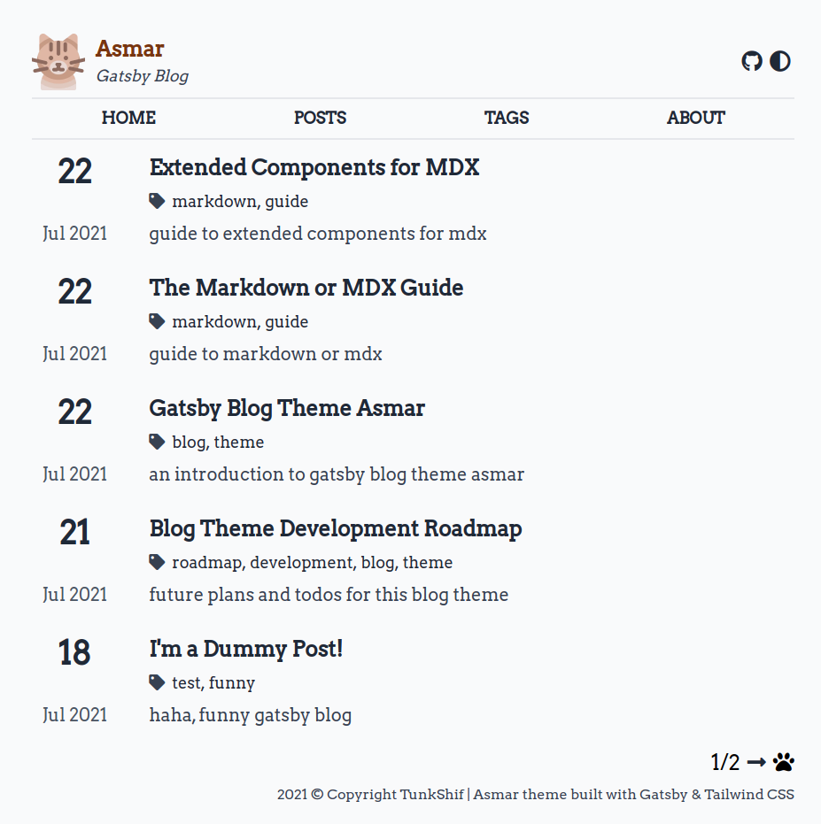

# Gatsby Blog Asmar Theme



[DEMO][1]

A minimal gatsby blog theme.

Inspired by [hugo-ink][0].

# TODO

- [x] Home Page
  - [x] Header
- [x] Posts Page
  - [x] Post list
  - [x] Pagination
- [ ] Article Page
  - [x] Basic typography style
  - [x] Responsive images
    - [x] Link to the original image
  - [x] Code highlighting
    - [ ] Click to copy
    - [ ] More language support
  - [x] TOC support
    - [ ] Details (transition, animation)
  - [x] Scroll to top button
  - [ ] Comment
  - [ ] MathJax/Katex support
- [x] Tags Page
- [x] 404 Page
- [x] About Page
  - [ ] More custom stuff
  - [ ] Chart display
- [ ] Dark mode
- [ ] Custom social media link buttons
- [ ] Tweet-like or weibo-like short post
- [ ] Gallery component
- [ ] Command for creating new post template
- [ ] i18n support
- [ ] Docs for basic usage and advanced custom

# Development

```sh
cd gatsby-blog-asmar
mkdir -p blog/posts # blog post written in mdx goes here
yarn # install all dependencies
yarn develop # run development server
yarn build # build the site
```

# Thanks

- awesome free pictures and icons from [freepik.com](https://www.freepik.com/) and [flaticon.com](https://www.flaticon.com/)

[0]: https://github.com/knadh/hugo-ink
[1]: https://gatsbythemeblogasmardemo.gatsbyjs.io/
